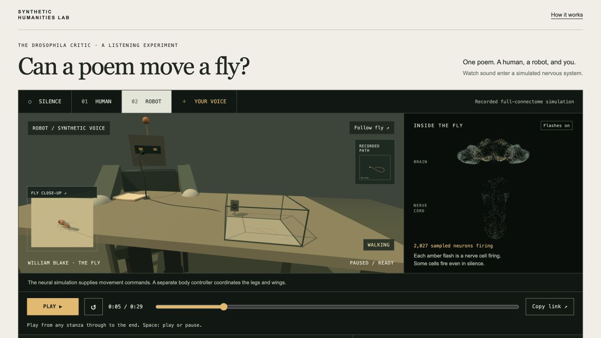

# The Drosophila Critic

**A fruit fly listens to poetry.** An artwork and listening experiment from the
Synthetic Humanities Lab.

[Open the app](https://synthetic-humanities-lab.github.io/drosophila-critic/) ·
[Method](METHOD.md) · [Scene checks](design-qa.md) · [Body-model checks](docs/MOVING-ARENA-QA.md)

A human and a robot read William Blake’s *The Fly* to the same simulated nervous
system. Choose either voice, compare it with silence, or process your own
recording locally, including experimental processing on phones. Sound and recorded neural activity replay
together. The poem appears once; five stanza buttons select starting points,
not excerpts that stop automatically.



Silence is the control. Neither reader is a standard to beat. The app reports
what changed in the simulation; it does not score poetry or describe a fly’s
feelings. An articulated fly walks, turns, takes off, flies and lands in a
20 × 16 × 10 cm glass listening box on a table. Recorded neural activity supplies commands;
separate frozen flybody policies coordinate the legs and wings in MuJoCo.
The [neural-to-body adapter](docs/NEURAL-BODY-ADAPTER.md) and its engineering
transitions are explicit assumptions, not a validated prediction of a living fly.
The reader speaks into a microphone wired to the box's speaker. The default
wide view includes a live close-up; **Follow fly** enlarges it, and **Whole table**
returns to the scene. The recorded path stays visible on the floor and in the
map. The nervous-system display continues to show actual sampled spikes.
The box stages the existing uniform sound field; it adds no distance or glass
acoustics to the model.

## Use your own voice

Choose **YOUR VOICE**, then record or select audio between 1 and 60 seconds.
Listen back before choosing **READ TO THE FLY**. That explicit action loads
roughly 156 MB of brain and body models, cached where possible. The browser runs
your sound and an equal-duration silence control, computes a separate body for
each, then replays your recording with its own neural activity and movement. Cancel stops processing without
submitting anything. A public robot example lets you try local processing
without microphone or file access.

Audio and results remain on the device. There is no upload, account, API key,
LLM, or paid compute service. Save the original audio, processed audio, and
response JSON before closing or reloading. A private result has no public share
link. **Save recording** is available before processing, so you can keep the
original even if a phone cannot finish the calculation. Model files alone are
cached. Clear this site’s browser storage to remove
them. Microphone hardware and browser decoding are uncontrolled variables;
visitor results are a single simulation pair, not the four-repeat example result.

The complete local workflow has a five-minute acceptance limit for 60 seconds
of audio on the tested desktop. See [moving-arena checks](docs/MOVING-ARENA-QA.md)
for measured timings, numerical tolerances, and devices actually tested.

Up-to-date iPhone Safari can record or open a file using the same interface.
Mobile processing is experimental: start with a short recording and keep the
page open. Phones (and browsers reporting at most 4 GB of device memory) reuse
one neural worker for sound and silence, then one body worker, with a fresh
state for each condition. Connectivity is released before body calculation.
Other desktops retain parallel processing. Both paths use the same complete
model, receiver, seed, and controls. This trades speed for lower memory use;
it does not qualify every phone or extend the desktop's five-minute claim to
phones. See [mobile recording checks](docs/MOBILE-RECORDING.md).

## Run the public app locally

Only Python’s standard library is needed to export and serve the committed
public artifacts. No Python simulator or TTS installation is needed for playback.

```sh
python3 scripts/export_replay.py
python3 -m http.server 8777 --bind 127.0.0.1 --directory dist
```

Open **http://127.0.0.1:8777/**. Microphone support requires a secure context;
localhost and HTTPS qualify. The main page does not fetch connectivity until
the visitor explicitly starts processing. `listen.html` redirects into this
shared interface. Historical query links open the current encounter. Research and benchmark
pages are excluded from the published site; their code and data remain in this
repository for local development. GitHub Actions rebuilds `dist/` and publishes it on pushes to
`main`; do not commit the generated directory or private recordings.

## What is being simulated?

```
audio waveform → virtual local air motion → modeled antennal displacement
               → 20 ms displacement envelope → original JO-A/B stimulation
               → frozen full connectome → recorded neural activity
```

MaleCNS supplies identities, annotations, coordinates and connectivity. The
pinned fly.ai model supplies its weight transformation, LIF update, noise and
138 JO-A/B auditory targets. Our published-reference mechanical filter and its
provisional neural coupling supply the sound input. There is no text analysis,
transcription, embedding, semantic category, training or learned readout in
this path. Blake’s displayed text is independent of visitor processing.

The interface shows raw rates alongside silence, with the average and full
range of four seeded runs for curated recordings. Each flash is a recorded
spike from a fixed sample of 12,000 cells, not all 166,700 cells; the spatial
view uses seed 1101. Population summaries use all cells in their named groups.
A seed varies simulated noise, not the biological fly.

The main app’s plain explanations use only measured rates, changes, and repeat
counts. The older separate **RESPONSE / READING** literary layer remains in
the repository for local research, outside the public app. It has not been
recast as biological evidence.

## Development and reproduction

The app uses plain JavaScript, vendored Three.js, Web Audio, and dedicated
workers. It has no npm build or framework dependency. Main boundaries:

| Code | Responsibility |
| --- | --- |
| `static/encounter.js`, `arena-scene.js / body-view.js`, `neural-scene.js` | One playback clock, staging, recorded neuron display |
| `static/recording-panel.js`, `local-session.js` | Recording lifecycle, privacy, worker progress/cancellation |
| `static/local-audio.js` | Mono conversion, fixed linear level policy, mechanical receiver |
| `static/browser-brain.js`, `browser-benchmark.worker.js` | Original numerical update and PCG64 noise |
| `static/neural-capture.js`, `playback-data.js` | Observational spike capture and sound/silence measurements |
| `scripts/export_encounter_playback.py` | Adapt saved runs into the versioned shared playback contract |

The browser model includes lossless original weights, checksums and required
annotations. See [browser qualification](docs/BROWSER-BENCHMARK.md) for exact
fixture reproduction and the separate development benchmark.

To run the optional Python simulator and scientific tests, use Python 3.12:

```sh
mkdir -p vendor data results
git clone https://github.com/alextitonis/fly.ai.git vendor/fly.ai
git -C vendor/fly.ai checkout --detach 5e931b8dc4856550565c5fa129d3d0c055af3dd1
python3.12 -m venv .venv
.venv/bin/python -m pip install -r requirements.txt
.venv/bin/python -c 'from flybrain import download; download("data")'
```

The Python connectome package is approximately 260 MB. These private working
files and all full spike archives are excluded from Git. To regenerate the
curated evidence, run `PYTHONPATH=. .venv/bin/python scripts/build_encounter.py`,
then `.venv/bin/python scripts/export_encounter_playback.py`. This requires the
existing credited audio and can take several minutes. Historical results are
versioned and must not be overwritten to change a scientific configuration.

For the historical text-to-TTS API, install its fixed voice with
`.venv/bin/python scripts/setup_voice.py`, run `./run.sh`, and open
`http://127.0.0.1:8765/archive.html`. It retains the older amplitude receiver;
it is not the current public mechanical-receiver experiment. See
[prototype documentation](docs/PROTOTYPE-README.md). Do not run multiple API
workers: its admission guard is process-local. No hosted API is required here.

Release checks:

```sh
.venv/bin/ruff check critic scripts tests
.venv/bin/ruff format --check critic scripts tests
.venv/bin/python -m pytest -q
node --test tests/*.test.mjs
.venv/bin/python scripts/export_replay.py
```

## Evidence and credits

- [Neural playback contract](docs/ENCOUNTER-V2.md) and [current body/audio manifest](experiments/encounter-v3/manifest.json).
- [Curated receiver protocol](docs/ENCOUNTER.md), [source audit](experiments/receiver-v2/CALIBRATION.md), and [strength checks](experiments/encounter-v1/sensitivity.json).
- [Movement checks](docs/MOVING-ARENA-QA.md), [adapter](docs/NEURAL-BODY-ADAPTER.md), and [measured comparisons](experiments/encounter-v3/movement-summary.json).
- [Current status](docs/MOVING-ARENA-STATUS.md). Historical research remains in
  the repository; the research archive is no longer published as an app.

Blake’s poem is public domain. Human audio: Denny Sayers, LibriVox, 2006. Robot:
Kokoro `af_sarah`, fixed settings. Current anatomy: flybody;
[anatomy notice](static/assets/flybody/NOTICE.txt),
[policy/data notice](static/assets/body-v1/NOTICE.txt), and
[MuJoCo license](static/vendor/mujoco/LICENSE.txt) retain attribution.
flybody source and MuJoCo are Apache 2.0; the separately published policies and
wingbeat dataset are GPL 3.0+. The body inference/export components are supplied
under GPL 3.0+ with corresponding source and original dataset files. The earlier
NeuroMechFly asset remains credited in the historical source. Reader gestures
are theatre; the fly's trajectory is simulated.

## Reproduce the moving body

Playback needs only the committed artifacts. Rebuilding physics uses a separate
Python 3.12 environment, not the lightweight API environment:

```sh
python3.12 -m venv vendor/flybody/.venv
vendor/flybody/.venv/bin/pip install 'numpy==1.26.4' 'mujoco==3.14.0' \
  'dm-control==1.0.47' 'tensorflow==2.16.2' 'tensorflow-probability==0.24.0' \
  'tf-keras==2.16.0'
vendor/flybody/.venv/bin/pip install -e vendor/flybody
```

Clone `TuragaLab/flybody` into `vendor/flybody` first and check out
`d015e9bfe441bd90ae431bac24c55cb74bdbce26`. Unpack the supplied
`static/assets/body-v1/source/trained-fly-policies.zip` so the two SavedModel
directories are `results/body-controller/policies/walking` and `flight`. Copy
the supplied `wing_pattern_fmech.npy` into
`results/body-controller/flight-data/`. Then, from the repository root:

```sh
export MUJOCO_GL=disable MPLBACKEND=Agg MPLCONFIGDIR=/tmp/drosophila-mpl
export TF_CPP_MIN_LOG_LEVEL=2 OPENBLAS_NUM_THREADS=1 VECLIB_MAXIMUM_THREADS=1
export PYTHONPATH=.
BODY_PY=vendor/flybody/.venv/bin/python
$BODY_PY scripts/qualify_flight_controller.py
$BODY_PY scripts/export_body_policies.py
$BODY_PY scripts/build_body_model.py
$BODY_PY scripts/export_body_browser.py
$BODY_PY scripts/export_body_validation.py
node scripts/check_body_browser.mjs
node scripts/check_body_runtime.mjs
node scripts/check_body_causality.mjs
$BODY_PY scripts/run_body_trajectories.py --diagnostic
$BODY_PY scripts/run_body_batch.py
python3 scripts/export_moving_encounter.py
python3 scripts/export_replay.py
```

The full batch additionally needs `data/brain.npz` and the existing complete
`results/encounter-v1/*/spikes.npz` recordings. It reads all spikes in selected
motor populations. It never reruns or changes the neural model. The new
`encounter-v3` manifest preserves the older neural/audio artifacts and names the
body trajectories for all four paired seeds.

The small SIMD dense-layer kernel is committed as `static/body-dense.wasm`; its
source is `scripts/body_dense.wat`. Rebuild with WABT's `wat2wasm` (SIMD enabled):
`wat2wasm scripts/body_dense.wat -o static/body-dense.wasm`. MuJoCo's official
single-threaded 3.14.0 distribution is vendored separately.

With the local Python development server described above, open `/body-proof.html`
for the controlled movement demonstration, or `/body-benchmark.html` to measure
the full local 60-second workflow.
These pages are excluded from the public export. Neither calls a processing server.
