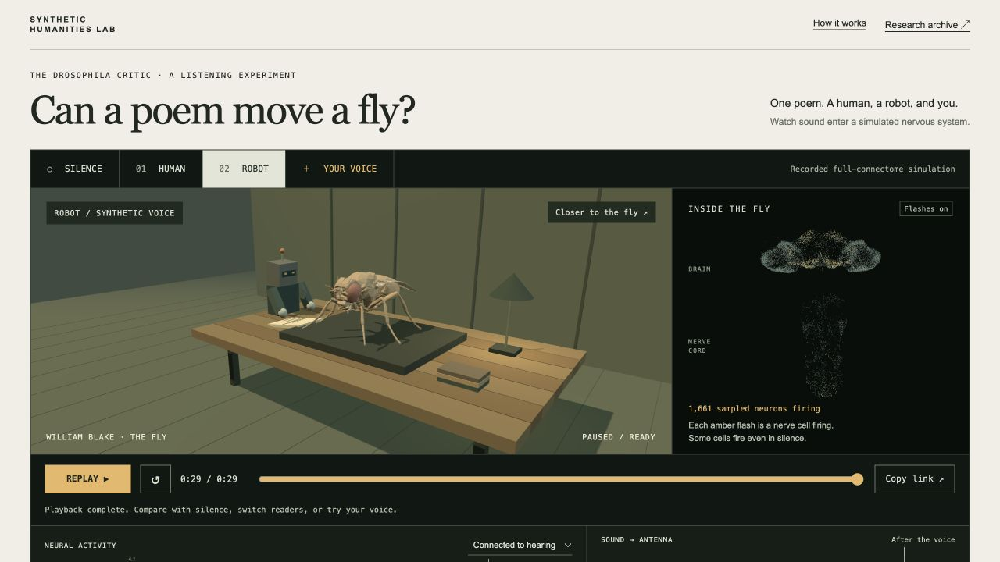

# The Drosophila Critic

**A fruit fly listens to poetry.** An artwork and listening experiment from the
Synthetic Humanities Lab.

[Open the app](https://synthetic-humanities-lab.github.io/drosophila-critic/) ·
[Method](METHOD.md) · [Release checks](docs/FINALIZATION-QA.md)

A human and a robot read William Blake’s *The Fly* to the same simulated nervous
system. Choose either voice, compare it with silence, or process your own
recording on a supported desktop. Sound and recorded neural activity replay
together. The poem appears once; five stanza buttons select starting points,
not excerpts that stop automatically.



Silence is the control. Neither reader is a standard to beat. The app reports
what changed in the simulation; it does not score poetry or describe a fly’s
feelings. The fly body remains posed. Antennal colour marks modeled vibration
strength, and the nervous-system display shows actual sampled spikes. An
existing research walking controller was tested successfully, but a defensible
connection from this connectome to that controller is not yet qualified. See
[the body-controller audit](docs/BODY-CONTROLLER.md).

## Use your own voice

Choose **YOUR VOICE**, then record or select audio between 1 and 60 seconds.
Listen back before choosing **READ TO THE FLY**. That explicit action loads a
139 MB losslessly compressed model, cached where possible. The browser runs
your sound and an equal-duration silence control, then replays your recording
in the main scene with its own neural activity. Cancel stops processing without
submitting anything. A public robot example lets you try local processing
without microphone or file access.

Audio and results remain on the device. There is no upload, account, API key,
LLM, or paid compute service. Save the original audio, processed audio, and
response JSON before closing or reloading. A private result has no public share
link. Model files alone are cached. Clear this site’s browser storage to remove
them. Microphone hardware and browser decoding are uncontrolled variables;
visitor results are a single simulation pair, not the four-repeat example result.

Desktop qualification currently covers Chromium 154 on the development Mac.
The complete robot/human simulations with spatial capture took 46.38/40.37 s
for 26.17/45.10 s of audio. Processing also runs silence, so the complete visitor
workflow takes longer. Other browser engines and smaller devices have not been
benchmarked. Earlier timing runs were slower; this is not a speed guarantee.
Phones retain recorded playback; local processing is disabled.

## Run the public app locally

Only Python’s standard library is needed to export and serve the committed
public artifacts. No Python simulator or TTS installation is needed for playback.

```sh
python3 scripts/export_replay.py
python3 -m http.server 8777 --bind 127.0.0.1 --directory dist
```

Open **http://127.0.0.1:8777/**. Microphone support requires a secure context;
localhost and HTTPS qualify. The main page does not fetch connectivity until
the visitor explicitly starts processing. `listen.html` redirects into this
shared interface. Historical `?mode=...` and `?reading=...` links go to the
research archive. GitHub Actions rebuilds `dist/` and publishes it on pushes to
`main`; do not commit the generated directory or private recordings.

## What is being simulated?

```
audio waveform → virtual local air motion → modeled antennal displacement
               → 20 ms displacement envelope → original JO-A/B stimulation
               → frozen full connectome → recorded neural activity
```

MaleCNS supplies identities, annotations, coordinates and connectivity. The
pinned fly.ai model supplies its weight transformation, LIF update, noise and
138 JO-A/B auditory targets. Our published-reference mechanical filter and its
provisional neural coupling supply the sound input. There is no text analysis,
transcription, embedding, semantic category, training or learned readout in
this path. Blake’s displayed text is independent of visitor processing.

The interface shows raw rates alongside silence, with the average and full
range of four seeded runs for curated recordings. Each flash is a recorded
spike from a fixed sample of 12,000 cells, not all 166,700 cells; the spatial
view uses seed 1101. Population summaries use all cells in their named groups.
A seed varies simulated noise, not the biological fly.

The main app’s plain explanations use only measured rates, changes, and repeat
counts. The older separate **RESPONSE / READING** literary layer remains in
the archive. It has not been recast as biological evidence.

## Development and reproduction

The app uses plain JavaScript, vendored Three.js, Web Audio, and a dedicated
worker. It has no npm build or framework dependency. Main boundaries:

| Code | Responsibility |
| --- | --- |
| `static/encounter.js`, `encounter-scene.js`, `neural-scene.js` | One playback clock, staging, recorded neuron display |
| `static/recording-panel.js`, `local-session.js` | Recording lifecycle, privacy, worker progress/cancellation |
| `static/local-audio.js` | Mono conversion, fixed linear level policy, mechanical receiver |
| `static/browser-brain.js`, `browser-benchmark.worker.js` | Original numerical update and PCG64 noise |
| `static/neural-capture.js`, `playback-data.js` | Observational spike capture and sound/silence measurements |
| `scripts/export_encounter_playback.py` | Adapt saved runs into the versioned shared playback contract |

The browser model includes lossless original weights, checksums and required
annotations. See [browser qualification](docs/BROWSER-BENCHMARK.md) for exact
fixture reproduction and the separate development benchmark.

To run the optional Python simulator and scientific tests, use Python 3.12:

```sh
mkdir -p vendor data results
git clone https://github.com/alextitonis/fly.ai.git vendor/fly.ai
git -C vendor/fly.ai checkout --detach 5e931b8dc4856550565c5fa129d3d0c055af3dd1
python3.12 -m venv .venv
.venv/bin/python -m pip install -r requirements.txt
.venv/bin/python -c 'from flybrain import download; download("data")'
```

The Python connectome package is approximately 260 MB. These private working
files and all full spike archives are excluded from Git. To regenerate the
curated evidence, run `PYTHONPATH=. .venv/bin/python scripts/build_encounter.py`,
then `.venv/bin/python scripts/export_encounter_playback.py`. This requires the
existing credited audio and can take several minutes. Historical results are
versioned and must not be overwritten to change a scientific configuration.

For the historical text-to-TTS API, install its fixed voice with
`.venv/bin/python scripts/setup_voice.py`, run `./run.sh`, and open
`http://127.0.0.1:8765/archive.html`. It retains the older amplitude receiver;
it is not the current public mechanical-receiver experiment. See
[prototype documentation](docs/PROTOTYPE-README.md). Do not run multiple API
workers: its admission guard is process-local. No hosted API is required here.

Release checks:

```sh
.venv/bin/ruff check critic scripts tests
.venv/bin/ruff format --check critic scripts tests
.venv/bin/python -m pytest -q
node --test tests/*.test.mjs
.venv/bin/python scripts/export_replay.py
```

## Evidence and credits

- [Current playback contract](docs/ENCOUNTER-V2.md) and [manifest](experiments/encounter-v2/manifest.json).
- [Curated receiver protocol](docs/ENCOUNTER.md), [source audit](experiments/receiver-v2/CALIBRATION.md), and [strength checks](experiments/encounter-v1/sensitivity.json).
- [Body-controller test](experiments/body-controller-v1/command-test.json) and [poem output audit](experiments/body-controller-v1/poem-output-audit.json).
- [Current status](docs/GOAL-STATUS.md) and [research archive](https://synthetic-humanities-lab.github.io/drosophila-critic/archive.html).

Blake’s poem is public domain. Human audio: Denny Sayers, LibriVox, 2006. Robot:
Kokoro `af_sarah`, fixed settings. Fly asset: NeuroMechFly/FlyGym;
[asset notices](static/assets/fly/NOTICE.txt) retain the license and attribution.
fly.ai is MIT-licensed. The optional flybody audit uses its Apache-2.0 source
and public pretrained checkpoint; that controller and its dependencies are not
shipped with the website. Reader gestures are theatre, not simulation output.
